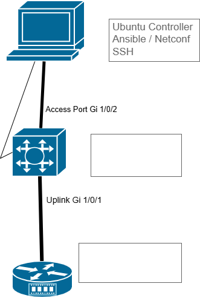

# Enterprise Network Automation Capstone

## Overview

This project documents the staged build of an enterprise-style network automation lab using an Ubuntu-based automation controller and Cisco IOS-XE infrastructure.

The goal is to move from manual CLI-based device administration toward repeatable network automation using structured playbooks, standards-based management protocols, and model-driven configuration workflows.

The project establishes a repeatable automation workflow using Ansible as the controller and NETCONF/YANG as the model-driven configuration interface.

Current implementation focuses on validating management-plane connectivity, controller preparation, protocol enablement, and safe configuration change workflows before expanding into larger multi-device automation.

---

## Current Lab Topology



---

## Management Network

The automation controller communicates with network devices across a dedicated management subnet.

The controller is connected through a Catalyst switch which currently serves as a Layer 2 access path between the Ubuntu controller and the ISR router.

| Device               | Role                  | Address        |
| -------------------- | --------------------- | -------------- |
| Ubuntu Controller VM | Automation Host       | 192.168.50.100 |
| Catalyst Switch S1   | Layer 2 access path   | N/A            |
| Cisco ISR Router R1  | Managed IOS-XE target | 192.168.50.1   |

---

## Current Architecture Roles

### Ubuntu Controller VM

* Runs Ansible
* Stores inventory files
* Executes SSH and NETCONF automation workflows
* Hosts YAML playbooks

### Catalyst Switch S1

* Provides Layer 2 access between controller and router
* Preserves scalable topology for future device onboarding

### Cisco ISR Router R1

* Primary managed automation target
* IOS-XE validation platform
* NETCONF-enabled device under test

---

## Technology Stack

* Ubuntu Linux
* Ansible
* YAML
* Cisco IOS-XE
* SSH
* NETCONF
* YANG
* Git / GitHub

---

## Repository Structure

```text id="4p8k2m"
enterprise-network-automation-capstone/
├── diagrams/
├── docs/
├── evidence/
└── README.md
```

---

## Documentation Sequence

| Step | Document                            |
| ---- | ----------------------------------- |
| 00   | Project overview                    |
| 00a  | Controller build                    |
| 01   | Platform versions and upgrade       |
| 01a  | Initial device preparation          |
| 01b  | Management plane design             |
| 02   | SSH access and crypto compatibility |
| 03   | Ansible CLI automation              |
| 04   | NETCONF YANG enablement             |
| 05   | First NETCONF data retrieval        |
| 06   | YANG model exploration              |
| 07   | Ansible playbook automation         |
| 08   | Controller environment lessons      |
| 09   | Troubleshooting log                 |
| 10   | Project architecture summary        |

---

## Operational Validation

The following functions have been successfully validated in the current lab:

* SSH login from Ubuntu controller to Cisco IOS-XE router
* Legacy SSH crypto compatibility handling through local SSH config
* Ansible ping module communication
* Ansible ios_command execution
* IOS version verification through automation
* NETCONF service activation
* NETCONF process validation on router
* NETCONF hostname change using XML payload through Ansible

This section reflects completed functional milestones only.

---

## Evidence Mapping

| Capability             | Evidence Location |
| ---------------------- | ----------------- |
| IOS image validation   | evidence/         |
| SSH compatibility      | evidence/         |
| Ansible CLI automation | evidence/         |
| NETCONF enablement     | evidence/         |
| NETCONF config change  | evidence/         |

---

## Design Principles

* Build manually first, automate second
* Validate each protocol independently before increasing complexity
* Preserve reproducibility at every stage
* Separate evidence from design documentation
* Expand topology only after control-plane stability is confirmed

---

## Current Project Status

### Completed

* Controller built
* Router upgraded to IOS-XE 16.09.06
* SSH access stabilized
* Ansible operational
* NETCONF operational
* First model-driven config change completed

### In Progress

* Diagram refinement
* Evidence alignment
* Documentation cleanup

### Planned Next

* Switch onboarding
* Additional managed targets
* RESTCONF testing
* Multi-device automation workflows

---

## Long-Term Objective

Scale this environment into a mock enterprise automation platform capable of managing:

* Multiple routers
* Multiple switches
* Wireless infrastructure
* Additional Linux automation targets

The long-term target is a repeatable enterprise-style management architecture built from first principles.

---
