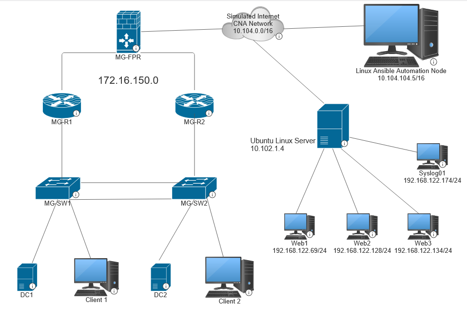

# Enterprise Network Automation Capstone

## Overview

This project documents the staged development of an enterprise-style automation platform integrating network automation, infrastructure automation, centralized logging, and future Microsoft enterprise services.

The project began as a proof-of-concept for Cisco IOS-XE automation using Ansible and NETCONF and has expanded into a multi-tier infrastructure platform capable of provisioning and managing both network devices and Linux server infrastructure from a centralized automation controller.

The long-term objective is to build a repeatable enterprise management architecture capable of deploying, configuring, validating, and monitoring network and server infrastructure through Infrastructure as Code (IaC) principles.

---

## Project Objectives

### Network Automation

* Automate Cisco IOS-XE devices
* Implement NETCONF and YANG workflows
* Reduce manual CLI administration
* Validate model-driven management techniques

### Infrastructure Automation

* Deploy virtual machines automatically
* Implement Infrastructure as Code workflows
* Utilize cloud-init for unattended provisioning
* Manage Linux services through Ansible

### Enterprise Services

* Centralized logging
* Monitoring
* Active Directory services
* Multi-tier application infrastructure

---

## Current Enterprise Automation Architecture

<p align="center">
  
</p>

---

## Technology Stack

### Automation

* Ansible
* YAML
* SSH
* Python
* Paramiko
* ncclient

### Network Infrastructure

* Cisco IOS-XE
* NETCONF
* YANG
* Catalyst Switching
* Cisco Firepower

### Server Infrastructure

* Ubuntu Linux
* KVM
* libvirt
* cloud-init
* qemu-img
* virt-install

### Services

* Nginx
* rsyslog

### Development

* Git
* GitHub
* Draw.io

---

## Repository Structure

```text
enterprise-network-automation-capstone/

├── automation/
│   ├── ansible/
│   ├── netconf/
│   └── kvm/
│
├── diagrams/
│
├── docs/
│
├── evidence/
│   ├── phase-1/
│   ├── phase-2/
│   └── phase-3/
│
└── README.md
```

---

## Documentation Sequence

### Phase 1 – Network Automation Foundation

| Step | Document                            |
| ---- | ----------------------------------- |
| 00   | Project Overview                    |
| 00a  | Controller Build                    |
| 01   | Platform Versions and Upgrade       |
| 01a  | Initial Device Preparation          |
| 01b  | Management Plane Design             |
| 02   | SSH Access and Crypto Compatibility |
| 03   | Ansible CLI Automation              |
| 04   | NETCONF YANG Enablement             |
| 05   | First NETCONF Data Retrieval        |
| 06   | YANG Model Exploration              |
| 07   | Ansible Playbook Automation         |
| 08   | Controller Environment Lessons      |
| 09   | Troubleshooting Log                 |
| 10   | Architecture Summary                |

### Phase 2 – Multi-Branch Network Automation

| Step | Document                        |
| ---- | ------------------------------- |
| 11   | Multi-Branch Expansion          |
| 12   | Multi-Branch NETCONF Automation |
| 13   | Firepower Integration           |
| 14   | Multi-Site Architecture Summary |

### Phase 3 – Infrastructure Automation

| Step | Document                             |
| ---- | ------------------------------------ |
| 15   | KVM and libvirt Platform Preparation |
| 16   | Cloud-Init Automation                |
| 17   | First VM Deployment                  |
| 18   | Multi-VM Provisioning                |
| 19   | Automated Web Tier Deployment        |
| 20   | Centralized Logging Platform         |
| 21   | Infrastructure Architecture Summary  |

---

## Operational Validation

### Network Automation

Successfully validated:

* SSH connectivity to IOS-XE devices
* Legacy SSH crypto compatibility handling
* Ansible IOS command execution
* NETCONF service enablement
* NETCONF process validation
* NETCONF configuration changes
* Multi-branch inventory management
* Multi-device automation workflows

### Infrastructure Automation

Successfully validated:

* SSH automation to KVM host
* KVM/libvirt management
* cloud-init provisioning
* Virtual machine deployment through Ansible
* Multi-VM provisioning
* SSH key injection
* Automated package installation
* Service deployment and validation

### Enterprise Services

Successfully validated:

* Nginx deployment through automation
* Multi-server web tier creation
* Centralized syslog collection
* Remote log forwarding
* Automated service verification

---

## Evidence Mapping

| Capability              | Evidence Location |
| ----------------------- | ----------------- |
| IOS-XE Validation       | evidence/phase-1  |
| SSH Compatibility       | evidence/phase-1  |
| NETCONF Operations      | evidence/phase-1  |
| Multi-Branch Automation | evidence/phase-2  |
| Firepower Integration   | evidence/phase-2  |
| KVM Provisioning        | evidence/phase-3  |
| Cloud-Init Deployment   | evidence/phase-3  |
| Web Tier Deployment     | evidence/phase-3  |
| Centralized Logging     | evidence/phase-3  |

---

## Design Principles

* Build manually first, automate second
* Validate each technology independently
* Preserve reproducibility at every stage
* Maintain evidence-driven documentation
* Expand complexity only after validation
* Prefer standards-based management interfaces
* Treat infrastructure as code whenever possible

---

## Current Project Status

### Completed

* Ubuntu automation controller operational
* IOS-XE platform upgraded and validated
* SSH access stabilized
* Ansible operational
* NETCONF operational
* First model-driven configuration change completed
* Multi-branch inventory operational
* Multi-site automation validated
* Firepower management access validated
* KVM/libvirt infrastructure platform operational
* cloud-init deployment operational
* Automated VM provisioning operational
* Multi-VM deployment operational
* Automated web tier deployment operational
* Centralized logging platform operational

### In Progress

* Architecture diagram refinement
* Evidence organization
* Documentation expansion
* Repository restructuring

### Planned Next

* Windows Server automation
* Active Directory deployment
* Domain controller automation
* Monitoring platform deployment
* Containerized workloads
* RESTCONF validation
* Switch onboarding
* Enterprise service integration

---

## Long-Term Objective

Expand this environment into a complete enterprise automation platform capable of managing:

### Network Infrastructure

* Routers
* Switches
* Firewalls
* Wireless infrastructure

### Server Infrastructure

* Linux servers
* Windows servers
* Active Directory
* DNS
* DHCP

### Security Infrastructure

* Centralized logging
* Monitoring
* SIEM integration
* Detection engineering

### Automation Platform

* Infrastructure as Code
* Configuration management
* Automated validation
* Repeatable enterprise deployments

## AI Collaboration & Project Attribution

This project was developed collaboratively with the assistance of **OpenAI's ChatGPT**.

I designed the project around my own learning goals in infrastructure automation, Linux, Terraform, virtualization, containers, Git/GitHub, and AI-assisted operations. Throughout the project, I used ChatGPT as a technical collaborator to help me:

* Design and refine the overall project architecture.
* Break larger objectives into manageable implementation steps.
* Explain unfamiliar technologies, commands, and infrastructure concepts.
* Troubleshoot configuration errors and unexpected behavior.
* Generate and review example code, scripts, configuration files, and documentation.
* Identify security considerations and safer implementation patterns.
* Improve the organization and presentation of the project for a technical portfolio.

I do **not** represent every line of code or every technical solution in this repository as something I independently created from scratch without assistance. AI-generated suggestions were an important part of the development process.

My role was to build and operate the lab environment, provide the project requirements and constraints, implement and test the proposed solutions, troubleshoot failures, make design decisions, and verify that the resulting infrastructure and automation worked in my environment.

The purpose of this project is not to demonstrate that I can produce an entire infrastructure automation platform without references or assistance. It is to demonstrate my ability to **learn new technologies, work through technical problems, evaluate AI-generated solutions, implement them in a real lab environment, and understand the systems well enough to explain and defend the design decisions behind them.**

AI was used as a development and learning tool—not as a substitute for hands-on implementation, testing, or understanding.


The final objective is a unified automation platform capable of provisioning, configuring, validating, and maintaining enterprise infrastructure through code-driven workflows.
